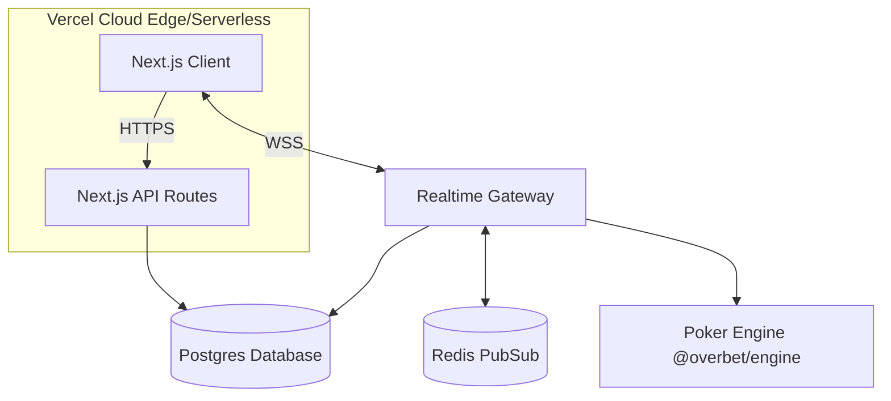
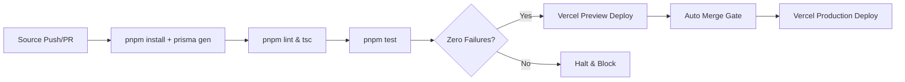
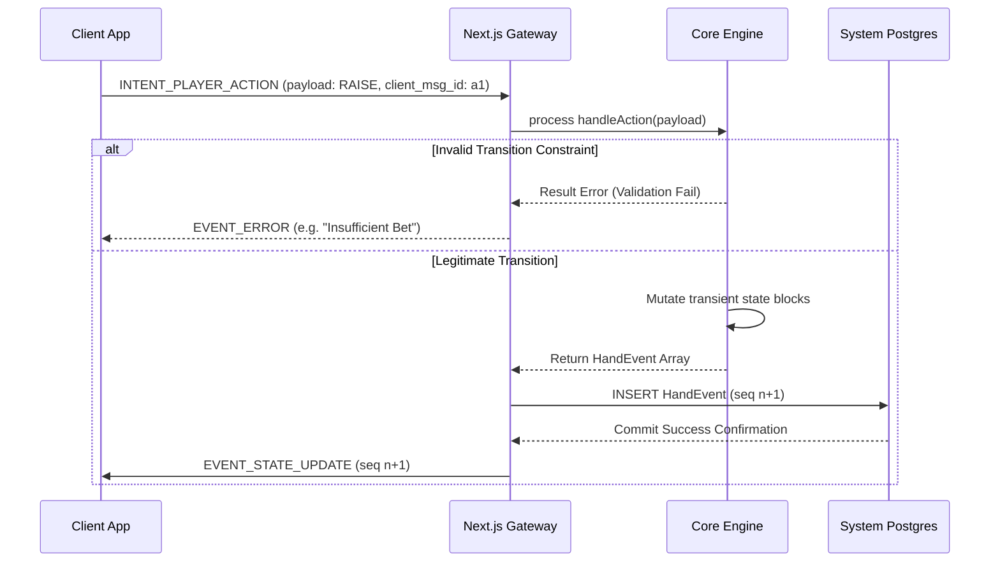
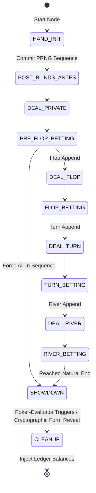

# OverBet: Development Specification (Post-Infrastructure)

## 1. Overview / Problem Statement
OverBet is a browser-first, real-time home-game poker platform. 
The core engine, web shell, secure randomness, real-time socket gateway, and math algorithms have been successfully implemented locally. The goal now is to execute the remaining product vision to achieve a fully playable, UI-complete, and accounting-superior application. This specification directs the autonomous implementation of the remaining scope in a verifiable, deterministic manner.

## 2. Scope + Non-Goals
### In Scope (v1)
- Table layout, seat management, chat UI, betting controls integration.
- Ledger exports, user settlement flows (confirm/dispute).
- Hand history replayer sequence component.
- Modifiers (straddle, ante, run-it-twice, bomb pots) via custom DSL configurations.
- Club communities (roles, leaderboards, membership logic).
- Scheduled Tournaments MVP definitions.

### Positive Non-Goals
- **Do not** implement real-money integrated payments or rake collection.
- **Do not** implement additional games outside the Hold'em/Omaha family (No Stud/Draw variants).
- **Do not** implement bots or AI opponents.
- **Do not** implement extensive password reset / email recovery flows in these phases (rely on existing anonymous session tokens or external auth hooks).

## 3. Assumptions & Baseline Context
### Completed Infrastructure Baseline
The following components are **complete and must not be regressively edited or dismantled**:
1. **Testing**: Vitest monorepo setup running in `< 2s` globally.
2. **Secure Randomness**: SHA-256 Commit-Reveal PRNG implemented via Node.js CSPRNG (`crypto.randomBytes`).
3. **Gateway**: Socket.io server with sanitization (deck/hole cards explicitly stripped from packets), room presence multiplexing, state snapshot catch-up, and monotonic `server_seq` event fanouts.
4. **Engine**: `NLHMachine` state machine, `Deck` generator, and `poker-evaluator` win determination.
5. **Math**: `calculateSessionPnL` and `generateSettlementMatrix` for optimized payout resolution.
6. **DB**: Prisma schema containing `Room`, `User`, `Hand`, `HandEvent` (event-sourced PostgreSQL with JSONB state formats).
7. **Web UI Shell**: Next.js minimal shell populated with "Navy Theme" global tokens and a `useUser` hook mapping for Host vs Guest detection rules.

## 4. Tech Stack & Environment Invariants
- **Runtime**: Node.js 20.x
- **Framework**: Next.js 14.x (App Router)
- **Package Manager**: pnpm 9.x
- **Language Strictness**: TypeScript 5.x (Strict mode enabled, no implicit `any`)
- **Real-Time Stack**: Socket.io 4.x
- **Database Engine**: PostgreSQL 15+ via Prisma ORM (`@prisma/client`)
- **Deployment & Hosting**: Vercel (Next.js Application & Serverless APIs)
- **Repo Rules Compatibility**: Implementation must follow local repo rules explicitly set in `AGENTS.md` (if present) and utilize base Turborepo workspace commands (e.g., `pnpm run build`, `pnpm test`).

### Dependency Mapping
- **Database**: PostgreSQL (Supabase / Local)
  - *Purpose*: Core state, ledger aggregations, and hand event sourcing.
  - *Auth*: Username/Password connection via `.env` placeholder `DATABASE_URL`.
  - *Failure Mode*: API returns 500; active sockets must gracefully terminate and request snapshot upon reconnection.
- **Cache / WebSocket Adapter**: Redis
  - *Purpose*: Ephemeral socket routing (Socket.io Redis adapter) and hard rate limits.
  - *Auth*: Placeholder `REDIS_URL`.
  - *Failure Mode*: Local fallback to memory map; cross-node broadcasting drops safely.

## 5. System Architecture

## 6. Data Model / Persistence
- **Schema Model** (Prisma ORM):
  - `User`: Identity identifiers, avatars, user preferences.
  - `Room`: Game configurations serialized via `JSONB`; transient session status.
  - `RoomMember`: Player stack balances, role allocations, seating map index.
  - `Hand` & `HandEvent`: Event-sourced append-only sequential logs.
  - `LedgerTransaction`: Computed finalized settlement payload instructions.
- **Migrations Strategy**: Use `pnpm dlx prisma migrate dev` strictly within local dev tracks. Do not write raw SQL overrides manually.
- **Seed/Test Data Strategy**: Relies on a scripted `seed.ts` via Dockerized local PostgreSQL.

## 7. Security / Auth Model
- **Identity Context**: Anonymous sessions inherently linked by `userId` maps (stored in `localStorage` securely orchestrated via `useUser`).
- **Data Guardrails**: All outbound `EVENT_STATE_UPDATE` packets MUST strictly execute through the Gateway's sanitization layer to drop unrevealed opponent hole cards.
- **Authorization Guardrails**: Modifying endpoints requires strict user ID validation. Only users designated with a `HOST` or `ADMIN` role in `RoomMember` are authenticated to pause a room, forcibly fold participants, or toggle phase settings.

## 8. Git Workflow & CI Pipeline Plan
- **Branching Model**: Trunk-based iteration model. Immediate feature extensions must inhabit short-lived `feature/<slug>` branches.
- **Commit Format**: Mandatory Conventional Commits specification (`feat:`, `fix:`, `test:`, `refactor:`, `chore:`).
- **PR Code Gates**:
  - Pull requests CANNOT merge unless CI passes.
  - Required execution: Linting strictness, strict Typechecking, tests successfully exiting.
  - Zero secrets rule: Implementation must strip hardcoded tokens.
- **CI Pipeline Definition**:
  - Triggers: Automatic on branch push / active PR update.
  - Setup: Ubuntu Latest wrapper -> Setup Node 20 -> Setup pnpm -> `pnpm install` -> `pnpm prisma generate`.
  - Execution Commands: `pnpm lint`, `pnpm test`. Conditioned to exit code `0`.
- **CD Pipeline (Vercel)**:
  - Branch pushes automatically trigger preview deployments via Vercel GitHub integration.
  - Merges to `main` trigger production deployments.

### CI Pipeline Orchestration Flow

## 9. Acceptance & Verification Plan
- **Eliminating Qualitative Testing**: Vague descriptors ("fast") are forbidden.
  - UI interaction to Socket broadcast payload MUST strictly meet a latency metric of `p95 < 150ms` internally.
  - Reliability is evaluated implicitly by zero synchronization lag. Any deviation prompts a snapshot.
- **Deterministic Validation Rules** (Integration Hierarchy):
  1. **E2E Integration** (Highest Priority): Playwright triggering automated `headless` seated interactions across a local containerized DB to simulate true connectivity. Mocks are generally disallowed for the socket pipeline.
  2. **Service Verification**: Vitest executing isolated class flows explicitly proving logic invariants without requiring live Express server wrappers.
- **Error Handling Contracts**: 
  - Standardized `{ error: string, code: "VALIDATION" | "AUTH" | "NOT_FOUND" }` payloads thrown to clients. Code boundaries uniformly wrap responses.

### Explicit State Transition Flow: Core Action Sequence

### Protocol Verification: Hand Lifecycle States

## 10. Phased Implementation Plan

### Phase 1: Table UI & Client State Linking
**Focus**: Execute the interactive frontend linking the WebSocket engine to the visual "felt" mechanics.
**Constraints**: Do not reconstruct Socket Gateway mechanics; they work correctly. Use isolated React state controllers. (Max 30 atomic tasks).
**Requirements**:
1. Mount a modular `PokerTable` React component rendering the geometric surface.
2. Initialize 1-to-9 responsive `Seat` components that snap dynamically arrayed.
3. Bridge `SocketClient.ts` to natively consume `EVENT_STATE_UPDATE` packets into a unified React hook (e.g., `useGameState`).
4. Display community board distributions intuitively.
5. Render active-player highlight logic based strictly on the authoritative turn cursor.
6. Render an interactive control interface for local-client's turn (Fold, Check, Call, Bet/Raise).
7. Transmit `INTENT_PLAYER_ACTION` when tapping controllers.
8. Hydrate graphical "WAITING" / "SEATED" seat logic using mapped array indices provided in recent detection patches.

**Phase 1 Exit Criteria**:
- **Build**: Command `pnpm --filter @overbet/web build` compiles beautifully.
- **Test**: Internal `vitest` logic hooks assert correct mapping translations.
- **What "Done" Means**: Real players can navigate 2 isolated browser instances, join the identical room ID, approve themselves, take their seats, and interact visually with buttons pushing the hand entirely through to completion.
- **Artifacts Produced**: Comprehensive UI React folder paths `apps/web/src/components/poker`, `useGameState` logic hooks.

### Phase 2: Ledger Exports Component & Settlement Confirmations
**Focus**: Execute UI wrappers leveraging the math-settlement code within `@overbet/engine` for post-game debt settlement.
**Constraints**: Generate isolated static export tables. (Max 25 atomic tasks).
**Requirements**:
1. Mount an interactive "Session Ledger Dashboard" linked from the primary Host configuration panel.
2. Dispatch a database pull against `calculateSessionPnL` utilizing historical snapshot state.
3. Feed resulting aggregates natively into the `generateSettlementMatrix` core.
4. Mount `LedgerModal` visualizing standard debt lines.
5. Provide a deterministic "Export Ledger CSV" client action mapping structured table objects to Blob text blocks.
6. Attach a `status = SETTLED` finalizing toggle constraint directly onto the Prisma `Room` context table.
7. Introduce tracking Booleans exposing users who explicitly toggle a dispute interaction hook via the DB.

**Phase 2 Exit Criteria**:
- **Build**: Command `pnpm build` cleanly traverses updated APIs.
- **Test**: Verified API integration validating that triggering a Host "Settle" mutation permanently disables further game transactions securely.
- **What "Done" Means**: Visual verification that stopping a room enables a button which calculates a perfect web table representation of debts, culminating in a viable CSV copy.
- **Artifacts Produced**: Ledger UI Modals, server-authoritative Route handlers for terminating a room status, Blob CSV compiler utility.

### Phase 3: Tournaments MVP & Logic Modifiers
**Focus**: Launch Scheduled Tournaments parameters and game variance constraints (Antes, Forced Straddles).
**Constraints**: Keep permutations isolated via conditional logic configurations, NOT WASM execution sandboxes. (Max 40 atomic tasks).
**Requirements**:
1. Inject structured configurations map formatting `{ ante: number, straddle: boolean }` tightly against Room initialization states.
2. Update the `NLHMachine` engine mapping to explicitly interpret this configuration at boot.
3. Inject auto-debit constraint checking inside the `POST_BLINDS_ANTES` state phase if `ante > 0`.
4. Render optional "Straddle UTG 2x" capabilities immediately preceding dealing conditions.
5. Migrate Prisma configuration appending a `Tournament` schema index mapped to concurrent related Rooms.
6. Design `Tournament Dashboards` accessible for elevated Host Director privileges, allowing Table-Balance shifts via intent routing changes.
7. Trigger sequential `EVENT_BLINDS` escalation hooks referencing Node-side timeline iterations.

**Phase 3 Exit Criteria**:
- **Build**: Execution block compilation.
- **Test**: Script integrations verifying mathematical consistency (e.g., Engine instantly forces standard Ante subtractions dynamically directly via sequence steps).
- **What "Done" Means**: Creating a game configuring distinct Antes immediately renders the correct pot deduction before actions occur manually. Elevated directors actively monitor table balances natively.
- **Artifacts Produced**: Engine configurator adjustments, Next.js Tournament Controller panel interface.

### Phase 4: Club Permanence & History Playback
**Focus**: Social verification endpoints aggregating player PnL limits across entire Club relationships and visual log reconstruction.
**Constraints**: Rely explicitly on indexed sequential reads, preventing excessive DB processing load. (Max 45 atomic tasks).
**Requirements**:
1. Mount a `Club` grouping Prisma identity and mapping cross-references to `ClubMember` allocations representing administrative roles.
2. Generate a `/clubs/[id]` endpoint mapping to custom Club Dashboards showing `all-time PnL Leaderboards` via SQL aggregation pulls.
3. Implement `History Archive` views scanning nested `HandId` associations appended per table iteration.
4. Consume sequential `HandEvent` entries from Postgres when querying requested log instances.
5. Render graphical timelines dynamically iterating timeline progression actions without rewriting the core felt component tree entirely.
6. Interlink the Crypto-Verify framework validating `SHA-256 Commitments` strictly to the specific sequence output string via UI flags.
7. Validate absolute log immutability via backend interceptors securing `HandEvent` databases from external patching overrides.

**Phase 4 Exit Criteria**:
- **Build**: Validated builds mapping fully across the monorepo bounds.
- **Test**: End-to-end `Playwright` suite successfully querying the Replay endpoint natively extracting sequential interactions and proving deterministic fairness.
- **What "Done" Means**: Members track historical standing leaderboards implicitly; clicking prior hands dynamically rescales visual UI state reconstructing actions effortlessly.
- **Artifacts Produced**: Club Directory/Dashboard layouts, Database Aggregation routes, Replay Component Sequence hook architecture.

End of Dev Spec.
